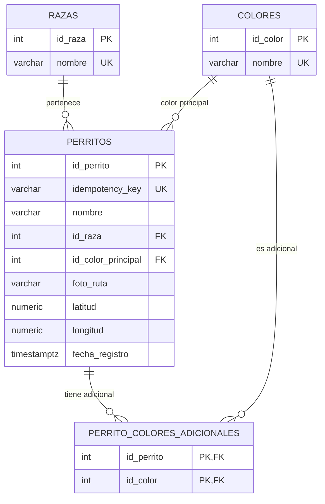

## Módulo de Base de Datos (DBA)

### Diagrama Entidad-Relación



### Configuración e Inicialización (Sin Docker)

1. Crear la base de datos en PostgreSQL:
   ```bash
   createdb -U postgres perritos_db
   ```
2. Cargar el esquema relacional e índices:
   ```bash
   psql -U postgres -d perritos_db -f database/schema.sql
   ```
3. Cargar los catálogos obligatorios y los 15 perritos de prueba:
   ```bash
   psql -U postgres -d perritos_db -f database/seeds.sql
   ```

### Respaldo y Restauración

* **Respaldar base de datos:**
  ```bash
  pg_dump -U postgres -d perritos_db -F c -b -v -f backup_perritos.dump
  ```
* **Restaurar base de datos:**
  ```bash
  pg_restore -U postgres -d perritos_db -v -c backup_perritos.dump
  ```

### Paradigma Declarativo en la Base de Datos

Las consultas de agregación, filtrado y relaciones se resuelven a nivel de motor en SQL declarativo, evitando transferir listas completas de datos para iterar en memoria:
* **Consulta con JOIN y agregación de texto (Listado y Detalle):**
  Agrupa los colores secundarios mediante `STRING_AGG` y une las tablas `razas` y `colores` sin ciclos en backend.
* **Consulta de Agregación analítica:**
  Utiliza `COUNT()` y `GROUP BY` sobre el catálogo para cuantificar registros por color directamente en el motor.
* **Idempotencia:**
  Se garantiza a nivel de motor mediante una restricción de unicidad (`UNIQUE`) sobre la columna `idempotency_key`, impidiendo duplicados ante reintentos de red o doble envío en el cliente.
