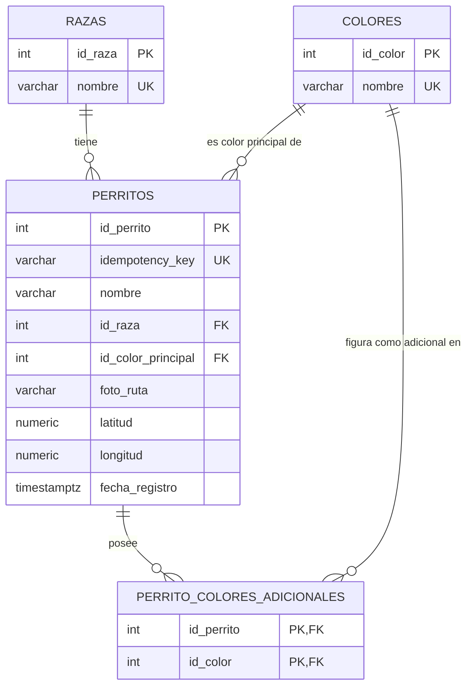

# Proyecto-ProLog-Unidad1

BDD-

```mermaid
erDiagram
    RAZAS ||--o{ PERRITOS : "tiene"
    COLORES ||--o{ PERRITOS : "es color principal de"
    PERRITOS ||--o{ PERRITO_COLORES_ADICIONALES : "posee"
    COLORES ||--o{ PERRITO_COLORES_ADICIONALES : "figura como adicional en"

    RAZAS {
        int id_raza PK
        varchar nombre UK
    }

    COLORES {
        int id_color PK
        varchar nombre UK
    }

    PERRITOS {
        int id_perrito PK
        varchar idempotency_key UK
        varchar nombre
        int id_raza FK
        int id_color_principal FK
        varchar foto_ruta
        numeric latitud
        numeric longitud
        timestamptz fecha_registro
    }

    PERRITO_COLORES_ADICIONALES {
        int id_perrito PK, FK
        int id_color PK, FK
    }
```
