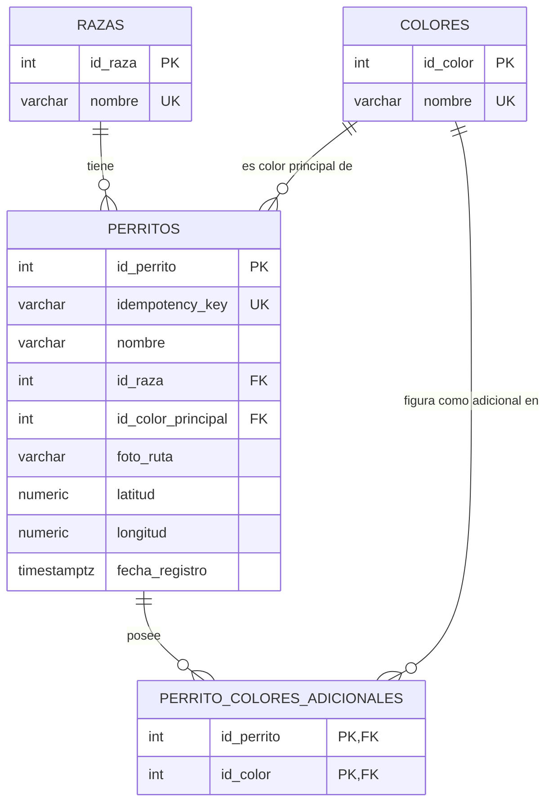

# Registro de Perritos de la Calle

<<<<<<< Updated upstream
=======
<<<<<<< Updated upstream
BDD-
=======
>>>>>>> Stashed changes
Proyecto 1 — Programación Lógica y Funcional — Prof. Daniel Varela

App para registrar perritos callejeros: foto, nombre, características y
ubicación en un mapa, para que rescatistas y vecinos sepan qué perros hay y
dónde andan.

## Integrantes y roles

| Integrante | Rol |
|---|---|
| Luis Palomares | Frontend |
| Ariel Hernández | Backend |
| Santiago | DBA |

## Requisitos previos

- Python 3.12
- PostgreSQL 18
- Navegador moderno (Chrome, Firefox, Edge)
- El frontend es HTML/CSS/JS plano, sin Node ni build tools

## Instalación

### Base de datos

```sql
CREATE DATABASE perritos_db;
```

```bash
psql -U postgres -d perritos_db -f database/schema.sql
psql -U postgres -d perritos_db -f database/seeds.sql
```

Los 15 perritos de prueba de seeds.sql referencian fotos que no vienen en el
repo, así que van a salir con la imagen rota hasta que se agreguen las fotos
reales a la carpeta de `RUTA_IMAGENES`.

### Backend

```bash
cd Back-End
<<<<<<< Updated upstream
=======
python3 -m venv venv
source venv/bin/activate
>>>>>>> Stashed changes
pip install -r requirements.txt
uvicorn main:app --reload --port 8000
```

Debe responder en http://localhost:8000 con `{"mensaje": "Api Funcional"}`.

### Frontend

Se sirve la carpeta `Frontend/` con Live Server (o cualquier servidor
estático) y se abre `index.html`. No abrir el archivo directo con doble
clic — como `file://` el navegador bloquea la cámara y las peticiones al
backend.

`Frontend/config.js` tiene la URL del backend:

```js
<<<<<<< Updated upstream
const API_BASE = "http://localhost:8000";
=======
const API_BASE = "http://100.52.230.125:8000";
>>>>>>> Stashed changes
```

## Probarlo desde celular en la misma red

Cambiar `API_BASE` en `config.js` por la IP local de la compu
(`http://192.168.x.x:8000`) y abrir el frontend desde el celular con esa
misma IP. Cámara y ubicación no van a pedir permiso así (solo funcionan en
HTTPS o localhost) — para probarlas de verdad hace falta HTTPS, ya sea la
versión desplegada o un túnel (ngrok).

## Modelo de datos
<<<<<<< Updated upstream
=======
>>>>>>> Stashed changes
>>>>>>> Stashed changes


```mermaid
erDiagram
    RAZAS ||--o{ PERRITOS : "tiene"
    COLORES ||--o{ PERRITOS : "es color principal de"
    PERRITOS ||--o{ PERRITO_COLORES_ADICIONALES : "posee"
    COLORES ||--o{ PERRITO_COLORES_ADICIONALES : "figura como adicional en"

    RAZAS {
        int id_raza PK
        varchar nombre UK
    }

    COLORES {
        int id_color PK
        varchar nombre UK
    }

    PERRITOS {
        int id_perrito PK
        varchar idempotency_key UK
        varchar nombre
        int id_raza FK
        int id_color_principal FK
        varchar foto_ruta
        numeric latitud
        numeric longitud
        timestamptz fecha_registro
    }

    PERRITO_COLORES_ADICIONALES {
        int id_perrito PK, FK
        int id_color PK, FK
    }
```
<<<<<<< Updated upstream
=======
<<<<<<< Updated upstream
=======
>>>>>>> Stashed changes

## Endpoints

| Método | Ruta | Descripción |
|---|---|---|
| GET | `/` | Health check |
| GET | `/api/catalogos` | Razas y colores |
| GET | `/api/imagenes/{nombre_archivo}` | Sirve una imagen guardada |
| GET | `/api/perritos` | Lista todos los perritos |
| POST | `/api/perritos` | Registra un perrito (multipart/form-data) |

`POST /api/perritos` recibe: `idempotency_key`, `nombre`, `latitud`,
`longitud`, `id_color_principal`, `id_raza` (opcional), `colores_adicionales`
(0 a 2), `foto`.

Falta: `GET /api/perritos` todavía no regresa los colores adicionales (falta
un JOIN con `perrito_colores_adicionales`), y falta al menos una consulta con
agregación.

## Problemas comunes

| Problema | Solución |
|---|---|
| "No se pudo conectar con el servidor" | El backend no está corriendo o `API_BASE` está mal |
| `ModuleNotFoundError: psycopg` | `pip install "psycopg[binary]"` |
| Falla autenticación de Postgres | El `DB_PASSWORD` no coincide, revisar en pgAdmin |
| No sale opción de tomar foto, solo "Seleccionar archivo" | Normal en desktop, `capture="environment"` solo aplica en celular |
| Cámara/ubicación no piden permiso en el celular | Falta HTTPS |

## Paradigmas

*(Falta la parte de backend/base de datos: SQL declarativo, JOIN, agregación)*

**Declarativo:** `index.html` y `style.css` describen qué debe verse, no cómo
dibujarlo — eso lo resuelve el navegador.

**Funcional:** en `app.js`, `cargarCatalogos()` arma las opciones de los
`<select>` con `.map()`:

```js
catalogoRazas.map(r => `<option value="${r.id}">${r.nombre}</option>`).join("")
```

Lo mismo hacen `pintarLista()` y `pintarMapaGeneral()` sobre el arreglo de
perritos, sin mutar el original ni usar ciclos.

**Idempotencia:** se genera un `idempotency_key` con `crypto.randomUUID()` al
abrir el formulario, se manda como campo del `FormData`. El backend revisa si
ya existe un perrito con esa key antes de insertar; si existe, regresa el
mismo `id_perrito` sin duplicar. La key solo se regenera después de un envío
exitoso — si falla, se reintenta con la misma.

Prueba de doble envío: se manda la misma petición dos veces por `curl` con el
mismo `idempotency_key`, y la segunda regresa el mismo `id_perrito` en vez de
crear un registro nuevo.

## Capturas

*(pendiente)*

## Despliegue
<<<<<<< Updated upstream

Backend corriendo en AWS en `http://100.52.230.125:8000`, sin HTTPS todavía —
falta dominio y certificado. Sin eso, cámara y ubicación no van a funcionar
desde celular contra esa URL.

Falta documentar: cómo se obtiene el dominio/certificado, variables entre
local y producción, puertos abiertos, respaldo de base e imágenes.
=======
El backend está publicado en una instancia EC2 de AWS con Ubuntu. La arquitectura de producción funciona de la siguiente manera:

Uvicorn + Systemd: La API de FastAPI se ejecuta en el puerto 8000 y está expuesta a internet directamente mediante la IP pública del servidor. Para mantenerla en producción de manera estable, se configuró un servicio nativo de Linux (systemd) que garantiza que la aplicación corra permanentemente en segundo plano y arranque de forma automática si la máquina se reinicia.

Conexión Frontend-Backend: El frontend está configurado para apuntar a la URL pública del backend ([http://100.52.230.125:8000](http://100.52.230.125:8000)). Debido a que el despliegue opera sobre HTTP plano y los navegadores bloquean el acceso al GPS sin un certificado HTTPS, la presentación del frontend se ejecuta desde un entorno local (localhost). Esto aprovecha la excepción de seguridad de los navegadores, permitiendo el uso completo del hardware (GPS/Cámara) mientras se consumen los datos reales de la base de datos alojada en AWS.
>>>>>>> Stashed changes
>>>>>>> Stashed changes
